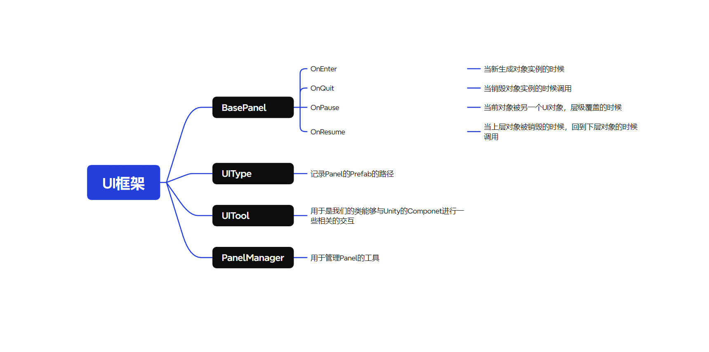
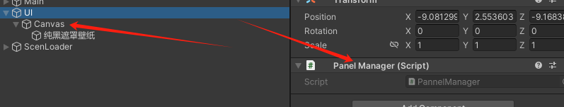

# UI框架的介绍


## 框架的安装
在目录Assets\Script\UIFramwork,将这个UIFramework文件夹复制拖入到你的工程，重载C#脚本就可以了。

## UI框架的使用

* 使用框架的时候，需要挂载PanelManager到任意的一个场景GameObject中，同时为了以后得管理，这个GameObject会成为一个持久化对象，存在于Don't Destory上。
* 同时我们需要创建一个子对象Canvas 并且挂载上Canvas的组件，注意！
* 创建的Canvas命名必须是Canvas!
* 创建的Canvas命名必须是Canvas!
* 创建的Canvas命名必须是Canvas!



如果你不想要说我要固定创建Canvas的话，那么就来到UIManager中找到这行代码
或者可以下载Unity打包好的文件，直接拖入即可

```C#
        public void InitUiManager()
        {
            //将这里的通过名字查找进行修改
            //只需要能找到画布对象就可以了
            parent = GameObject.Find("Canvas");
        }
```

### BasePanel的四个基础时事件回调

```C#
        /// <summary>
        /// 在实例化出预制体对象的时候调用
        /// </summary>
        public virtual void OnEnter()
        {
            
        }

        /// <summary>
        /// 在预制体还存在，打开一个新的UI的时候，会暂停这个UI，调用这个方法
        /// </summary>
        public virtual void OnPause()
        {
            
        }

        /// <summary>
        /// 上层的UI在关闭的时候，返回到下层UI，也就是当前的UI会调用
        /// </summary>
        public virtual void OnResume()
        {
            
        }
        
        /// <summary>
        /// 在Ui被销毁的时候调用这个方法
        /// </summary>
        public virtual void OnExit()
        {
            
        }
```

### Panel在场景的创建，退出

```C#
            //这个是先弹出栈顶部元素后，再塞入一个新的元素
            PanelManager.Instance.PopAndPush(new TestPanel());
            //这个是直接加入一个新的元素
            PanelManager.Instance.Push(new TestPanel());
            //这个是弹出栈最顶上的元素
            PanelManager.Instance.Pop();
```

### UITool的使用，请重点查看！
假设有这么一个UI常见，我现在想要获取到返回按钮，那么代码就应该是这样的


```C#
public class CallUsPanel : BasePanel
{

    public CallUsPanel() : base(new UIType(”路径，这里是你们自己的预制体路径“))
    {
    }
    
    Button backButton;

    override public void OnEnter()
    {
        base.OnEnter();
        
        //通过UITool去获取到指定名字的按钮，也就是 返回按钮
        backButton = UITool.GetOrAddComponentInChildren<Button>("返回按钮");

    }
}
```

其他用法请查看源码，如果想要修改源代码可以进入QQ群进行交流。

